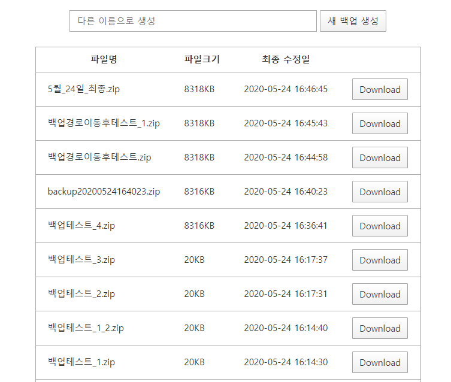

# 파일 백업 매니저
튜닝 후 튜닝 소스들을 쉽게 백업하고, 관리할 수 있는 백업 매니저입니다. 
사용중인 스킨과 관리자 스킨, 실적용 소스, 개발소스를 백업합니다.  
추가적으로 백업하고 싶은 디렉토리나 제외하고 싶은 디렉토리는 /module/Controller/Admin/Backup/BackupExecuteController.php 에서 지정하면 됩니다. 
적용 후 http://gdadmin.{도메인}/backup/backup_manager 로 이동하여 확인할 수 있습니다. 

# Preview

